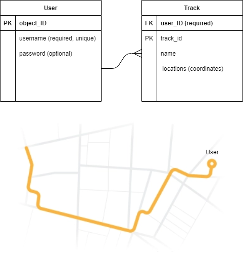

<!-- PROJECT LOGO -->
<br />
<p align="center">
  <a href="https://github.com/YunusEmreAlps/inTouch-Backend/">
    
  </a>

  <h3 align="center">inTouch - Backend</h3>

  <p align="center">
    Connecting you from around the world.
    <br />
    <a href="https://github.com/YunusEmreAlps/inTouch-Backend/archive/refs/heads/master.zip">Download</a>
    ·
    <a href="https://github.com/YunusEmreAlps/inTouch-Backend/issues">Report Bug</a>
    ·
    <a href="https://github.com/YunusEmreAlps/inTouch-Backend/issues">Request Feature</a>
  </p>
</p>

## Architecture

<p align="center">
  
</p>

## Used Technologies

- MongoDB: NoSQL database
- Node.js: General Platform
- Express.js: Middleware Framework
- Socket.IO: Messaging library

### Using Git (recommended)

1.  Clone the project from github. Change "myproject" to your project name.

```bash
git clone https://github.com/YunusEmreAlps/inTouch-Backend.git
```

### Using manual download ZIP

1.  Download repository
2.  Uncompress to your desired directory

### Install npm dependencies after installing (Git or manual download)

```bash
cd myproject
npm install
```

### Setting up environments

1.  Create a new file and then renaming it to just `.env`
    ```bash
    touch  .env
    ```
2.  The file `.env` is already ignored, so you never commit your credentials.
3.  Change the values of the file to your environment.
    ```bash
    MONGO_URI = YourConnectionString
    ```

## Project structure

```sh
.
├── server.js
├── package.json
├── package-lock.json
├── config
│   ├── db.js
│   ├── dbconfig.js
│   └── passport.js
├── methods
│   ├── actions.js
├── models
│   ├── user.js
├── routes
│   ├── index.js
├── ss
│   ├── architecture.png
│   ├── database.png
│   ├── icon.png
│   ├── icon1.png
│   ├── icon2.png
```

## How to run

### Running API server locally

```bash
npm run dev
```

You will know server is running by checking the output of the command `npm run dev`

```bash
Connected to mongodb:YOUR_DB_CONNECTION_STRING
App is running ...

Press CTRL + C to stop the process.
```

**Note:** `YOUR_DB_CONNECTION_STRING` will be your MongoDB connection string.

---

### MongoDB

- Part 1: Create an Atlas Account.
- Part 2: Deploy a Free Cluster.
- Part 3: Add Your Connection IP Address to Your IP Access List.
- Part 4: Create a Database User for Your Cluster.
- Part 5: Connect to Your Cluster.
- Part 6: Insert and View Data in Your Cluster.

* [MongoDB Atlas Kurulum](https://devnot.com/2019/mongodb-atlas-nedir-ve-nasil-olusturulur/)
* [MongoDB Atlas Tutorial](https://docs.atlas.mongodb.com/tutorial/deploy-free-tier-cluster/)


<p align="center">
  
</p>


### POSTMAN

<p align="center">
  <ul>
    <li>
     
    </li>
    <li>
     
    </li>
        <li>
     
    </li>
        <li>
     
    </li>
  </ul>
</p>